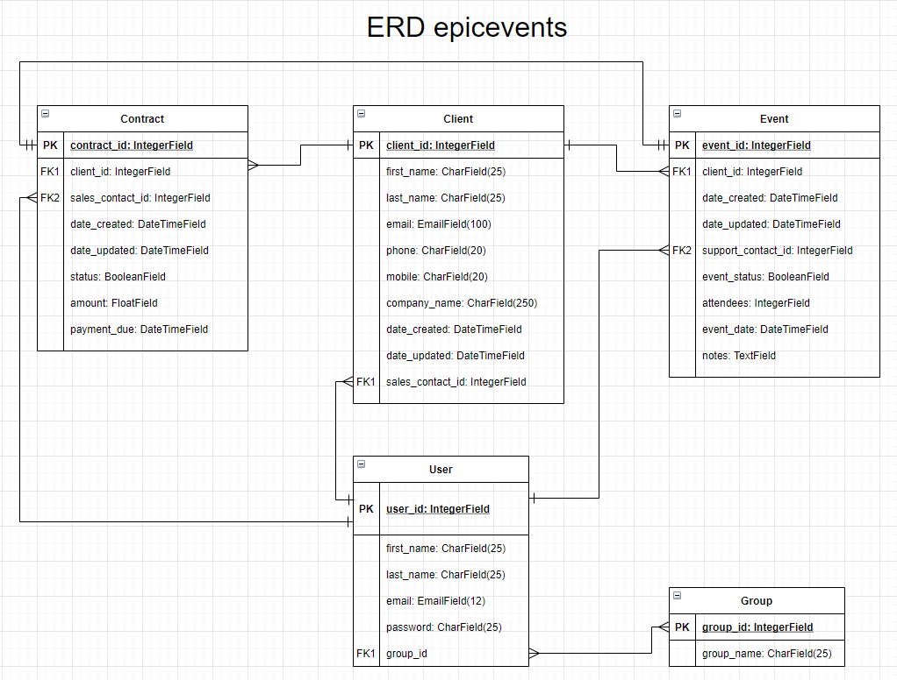

# Epic Events v1
**_Projet réalisé lors de ma formation de Développeur d'application Python à OpenClassrooms_**

 

_**"epicevents" is the CRM API of Epic Events with a secure back-end architecture. It uses a front-end web django admin interface for super-user and manager and a Django ORM in Postman for seller and support. It deal with:**_
* A user
* A client
* A contract
* An event

_**The API SoftDesk uses:**_
* Django
* Django Rest
* Postman
* PostgreSQL
* pgAdmin 4

_**The API epicevents has two applications:**_
1. account
1. crm

_**The PostgreSQL database to be used as example is in the file db_epicevents.sql**_

## Installation
* At lest Python 3.9.1 must be installed.
* Download the package application from github, unzip it and store it in a new directory.
* In the settings.py file, in the DATABASES part, modify the USER and the PASSWORD depending on your postgreSQL settings.
* Open a  new windows 10 terminal in this directory with the command `cmd`.
* Create a virtual environnement `python -m venv env`
* Activate the virtual environnement `env\Scripts\activate.bat`
* Install the last version of pip `python -m pip install --upgrade pip`
* Install the external Python packages with `pip install -r requirements.txt`
* In pgAdmin 4, create a database db_epicevents
* In the cmd terminal, migrate the db 
* `python manage.py makemigrations`
* `python manage.py migrate`
* Then In pgAdmin 4, restore the PostgreSQL database with the file db_epicevents.sql as example. To be done 2 times for a complete restoration.
* Attention, for safety reasons, the passwords must be changed after the deployment phase in production.

## Use
* Activate the virtual environnement `env\Scripts\activate.bat`
* Run the  le server `python manage.py runserver`
* In your best web browser, access to the django admin interface of the application to the URL `http://127.0.0.1:8000/admin`
* You can connect with the example super-user account:
>Username : admin1
>Password : 123654abc

* Or create another super-user account run `python manage.py createsuperuser`
* The password must contain at least 8 character, digits out of order and letters. It must not be common.

## Logging
* See errors.log in logs directory

## The PostgreSQL database
* The PostgreSQL database is configured in file settings.py in the DATABASES part.
* You can change the name of the db, the user or the password
* There are 3 groups already defined in file db_epicevents.sql
1. management (super-user + manager)
1. sales (seller)
1. support (support)

* The users to test:
1. admin1 (id1): is_active = True, is_staff = True, is_superuser = True
1. manager1 (id2): is_active = True, is_staff = True, is_superuser = False, group management
1. manager2 (id3): is_active = True, is_staff = True, is_superuser = False, group management
1. seller1 (id4): is_active = True, is_staff = False, is_superuser = False, group sales
1. seller2 (id5): is_active = True, is_staff = False, is_superuser = False, group sales
1. support1(id6): is_active = True, is_staff = False, is_superuser = False, group support
1. support2 (id7): is_active = True, is_staff = False, is_superuser = False, group support
1. lambda (id8): is_active = True, is_staff = False, is_superuser = False, no group

## The django admin interface
* A super-user (admin1) or a manager has access and works in Django admin
* The crud of user and group is done in the django admin interface by super-user or manager.
* A super-user has all rights
* Group management has all right on user
* Group management can read group and auth
* Group management has all right on client, contract and event
* When you create a new manager add in group management and set as active and team status
* When you create a new seller add in group sales and set as active
* When you create a new support add in group support and set as active

## Postam API documentation
* https://documenter.getpostman.com/view/15116700/Tzm6mG65
* See this documentation for the Authorization matrix by group
* You can import the collection as example EpicEvents.postman_collection.json
* Or create new requests as per the documentation
* Normally, the API is for seller and support.
* The managers have read only authorization for all objects in the API for check only.
* If they need to change an object, they can do it in the django admin interface.